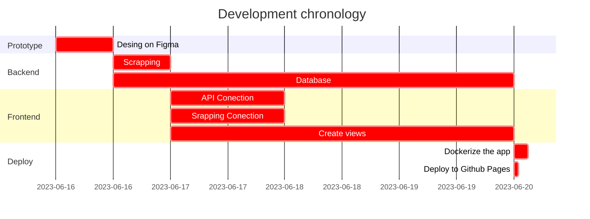

# AnimeListify - DRA Project
[](https://opensource.org/licenses/MIT)
[](https://github.com/rk400/animeListify/actions/workflows/main.yml)
[](https://github.com/rk400/animeListify/actions/workflows/gh-pages.yml)

[](https://www.figma.com/)
[](https://code.visualstudio.com/)
[](https://angular.io/)
[](https://spring.io/)
[](https://www.postgresql.org/)
[](https://www.docker.com/)

### Table of Contents
**[Description](#description)**<br>
**[Project deployment](#project-deployment)**<br>
**[Working tools](#working-tools)**<br>
**[Schedule](#schedule)**<br>
**[Author](#author)**<br>
**[License](#license)**<br>

## Description
AnimeListify is an application for anime tracking, where you can save your animes, and order in list.

## Project deployment

### Running with Docker
```cmd
docker-compose up -d
```

### Running manually
Create a network
```cmd
docker network create test
```
Starting frontend
```cmd
docker build -t frontend:v1 .\frontend\
docker run -d --name frontendA --network test -p 8080:80 frontend:v1
```
Starting backend
```cmd
docker build -t backend:v1 .\backend\
docker run -d --name backendA --network test -p 8081:8081 backend:v1
```
Starting database
```cmd
docker run -d --network test --name postgresql -e POSTGRES_USER=user -e POSTGRES_PASSWORD=pass -e POSTGRES_DB=db -p 5432:5432 -v data:/var/lib/pgsql/data postgres
```

## Working tools
These are the different tools that we are going to use in the project:


## Author


## Schedule


## License

Copyright (c) 2023 AnimeListify

Permission is hereby granted, free of charge, to any person obtaining a copy
of this software and associated documentation files (the "Software"), to deal
in the Software without restriction, including without limitation the rights
to use, copy, modify, merge, publish, distribute, sublicense, and/or sell
copies of the Software, and to permit persons to whom the Software is
furnished to do so, subject to the following conditions:

The above copyright notice and this permission notice shall be included in all
copies or substantial portions of the Software.

THE SOFTWARE IS PROVIDED "AS IS", WITHOUT WARRANTY OF ANY KIND, EXPRESS OR
IMPLIED, INCLUDING BUT NOT LIMITED TO THE WARRANTIES OF MERCHANTABILITY,
FITNESS FOR A PARTICULAR PURPOSE AND NONINFRINGEMENT. IN NO EVENT SHALL THE
AUTHORS OR COPYRIGHT HOLDERS BE LIABLE FOR ANY CLAIM, DAMAGES OR OTHER
LIABILITY, WHETHER IN AN ACTION OF CONTRACT, TORT OR OTHERWISE, ARISING FROM,
OUT OF OR IN CONNECTION WITH THE SOFTWARE OR THE USE OR OTHER DEALINGS IN THE
SOFTWARE.
